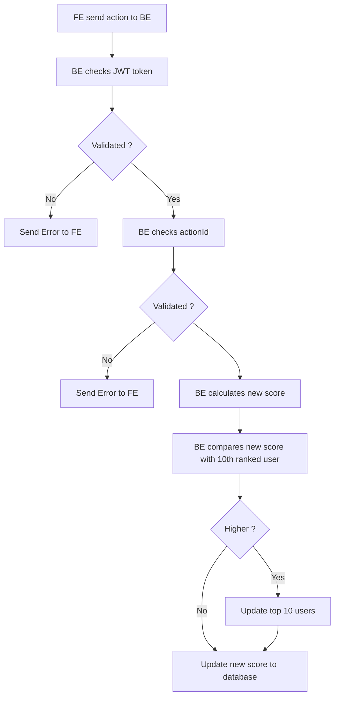

```mermaid
graph TD
A[FE send action to BE] -->B[BE checks JWT token]
    B --> C{Validated ?}
    C -->|No| E[Send Error to FE]
    C -->|Yes| D[BE checks actionId]
    D --> F{Validated ?}
    F -->|No| H[Send Error to FE]
    F --> G[BE calculates new score]
    G --> I[BE compares new score with 10th ranked user]
    I --> J{Higher ?}
    J -->|No| K[Update new score to database]
    J -->|Yes| L[Update top 10 users]
    L --> K[Update new score to database]
```
